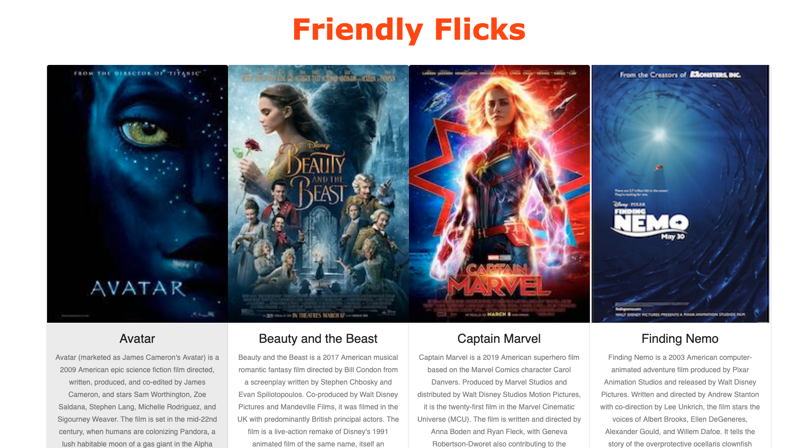
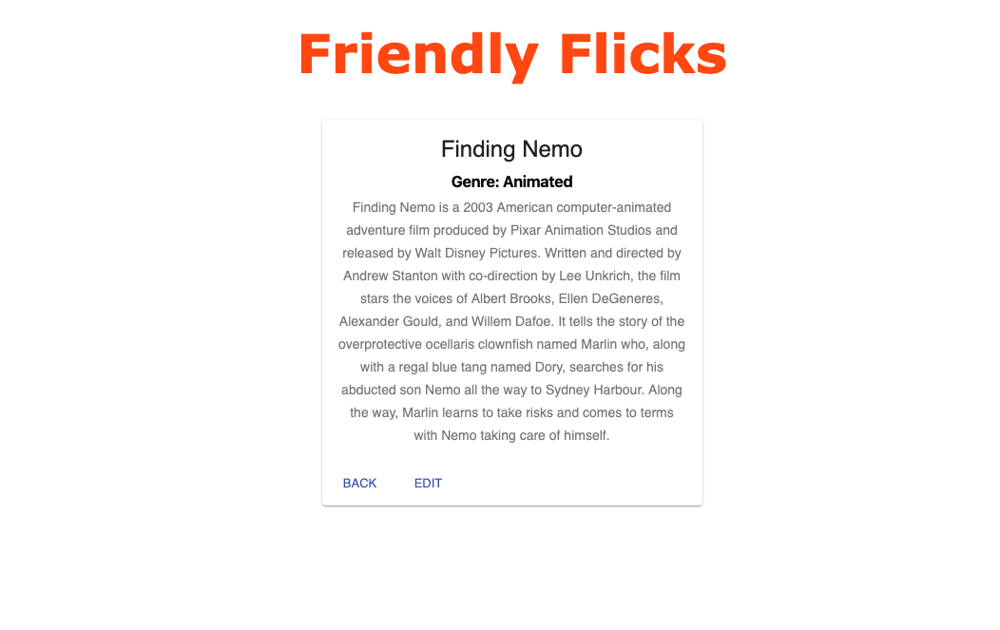
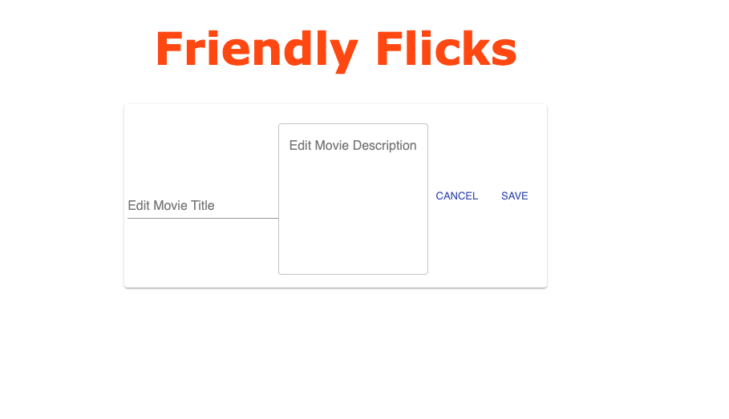

# Friendly Flix
---

## Description

Duration: 1 Weekend Sprint

- For this weekend challenge I built a movie application!
We are able to see movies that exist in our DB. We are also able to see a detailed view for each individual movie, including genres associated with that movie. We're also able to edit our movie's title and description.

## Database Setup

1. Create a database named `saga_movies_weekend`
2. Run the queries from `database.sql` on the `saga_movies_weekend` database.
 
---
Link
---
---
Screen shot

---

## Installation

1. fork this repository to your own github account
2. git clone onto local computer using terminal
3. open with code editor of your choice
4. npm install
5. npm start in terminal
6. npm run client in one terminal
7. npm run server in another terminal
8. go to http://localhost:3000/ to see Friendly Flicks
---

## Usage

1. browse movies
2. click a movie for more information includiong genre
3. click edit to edit title and description
---
## Built With

- html
- css
- javascript
- node
- express
- body-parser
- pg
- axios
- react
- redux
- redux sagas
- redux logger
- react router dom
- react scripts
- material ui

---
## Acknowledgment 

- Thanks to Luke Schlangen and Prime Academy who equipped me to make this application a reality
---
## Support

If you have suggestions or issues, please email me at <Luke.Schleder@gmail.com>
